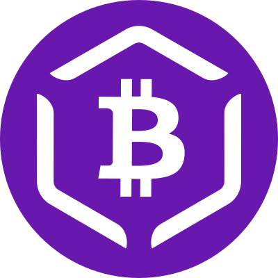
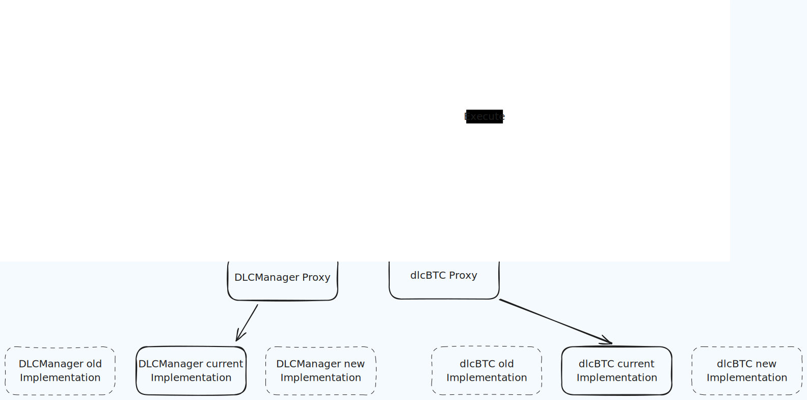

<!-- Join our Discord server for news and support!

[](https://discord.gg/TtzqyfPCvE) -->

<div align="center">
  
</div>

# dlc-solidity

[](https://github.com/DLC-link/dlc-solidity/actions/workflows/docker-build-and-push.yaml)
[](https://github.com/DLC-link/dlc-solidity/actions/workflows/hardhat-test.yaml)

This repo contains the solidity smart contracts for the DLC.Link infrastructure and the dlcBTC token.

Learn more about [DLCs](https://github.com/DLC-link/dlc-solidity#What-Are-DLCs) and [dlcBTC](https://dlcbtc.com).

# Overview

A DLC is a contract on Bitcoin that enables users to move/lock Bitcoin conditionally. The possible outcomes of a DLC are predefined and stored by the DLC.Link Attestor Layer. Bitcoin locked in such a way can be represented then on any EVM chain using these smart contracts. The outcome - that is, the value that will be 'attested' to - is supplied by smart contracts too.

This way, any EVM chain can essentially move native Bitcoin in a safe, "bridgeless" way. Ethereum can leverage the power of DLCs and the trust-minimised Attestor Layer that DLC.Link provides.

_dlcBTC_ is a token that represents Bitcoin locked in DLCs. It is minted when Bitcoin is locked in a DLC and burned when the DLC is settled.

Learn more about the whole architecture on the documentation site here:
https://docs.dlc.link/architecture/tech-stack

## Timelocked Upgrades

Some of the contracts in this repository are upgradeable. They can be changed by a multisig of dlcBTC team and external members. The upgrade process is timelocked, meaning that the upgrade will only happen after a certain time has passed (minimum 7 days). This is to ensure that the community has time to review the changes and react if necessary.



# Dev notes

## Testing

### Run unit tests

---

```
npm run test
```

\*optionally, `REPORT_GAS=true npm run test` to see gas usage.

Modify the `hardhat.config.js` for more testing / deployment options.

### See test coverage

```
npm run coverage
```

### Static analysis using Slither

In the root folder, run:

```
npm run analyze
```

## Scripts

In the `scripts` directory you will find various helper scripts.

Create a `.env` based on the `.env.template` fields.
Be sure to set the correct `HARDHAT_NETWORK` for the scripts to work properly. (Set 'localhost' when using hardhat).

The easiest way to use them is by running the package:

```bash
# If the following throws a 'command not found: dlc-link-eth' error, try running 'npm link' after 'npm i' to set up the symlink for your $PATH

# To see help:
dlc-link-eth --help
# For example for contract deployment and admin scripts:
dlc-link-eth contract-admin
```

To start a local hardhat node to test against:

```bash
npx hardhat node
```

Note that properly testing the entire DLC creation flow requires more of the DLC.Link infrastructure running -- but contract-integration can still be tested thoroughly and easily using the [testing framework](https://github.com/DLC-link/dlc-solidity#Testing).

# Contributing

We are happy to have support and contribution from the community. Please find us on Discord and see below for developer details.

## Setup

For reference, you can find samples of the deployed contract by checking the deploymentFiles directory in this project.

Add a `.env` file with the following fields:

```bash
# Infura key
INFURA_PROJECT_ID=
# Deployer private key
KEY=
# optional
KEY2=
# optional
KEY3=
# Etherscan API KEY (optional)
# only needed for submitting the contract to etherscan
ETHERSCAN_API_KEY=
# Network to use e.g. localhost(for hardhat)/goerli/sepolia/mainnet
HARDHAT_NETWORK=
# Coinmarketcap API KEY (optional, for gas calculations)
COINMARKETCAP_API_KEY=
# Report gas usage after test run (optional) boolean
REPORT_GAS=
# SAFE key signer (optional)
SCRIPT_KEY=

```

# What Are DLCs

[Discreet Log Contracts](https://dci.mit.edu/smart-contracts) (DLCs) facilitate conditional payments on Bitcoin between two or more parties. By creating a Discreet Log Contract, two parties can form a monetary contract redistributing their funds to each other without revealing any details to the blockchain. Its appearance on the Bitcoin blockchain will be no different than an ordinary multi-signature output, so no external observer can learn its existence or details from the public ledger. A DLC is similar to a 2-of-3 multisig transaction where the third participant is an “oracle”. An oracle is a 3rd party source of data or information that the parties to the DLC trust as the source of truth for the contract. The oracle is incentivized to be a fair arbiter of the contract.

# About DLC Link

DLC.Link is building infrastructure to empower decentralized applications and smart contract developers to easily leverage the power of DLCs. We provide companies and applications with a traditional REST API and a smart contract interface to create and manage DLCs for their use cases.

DLCs require an oracle to attest to a specific outcome among the predefined set of outcomes. That means trust.

Why power DLC oracles with smart contracts? By using a smart contract for this task, the implementation of the logic, as well as the data being used, is stamped on the chain, and is _visible and reviewable_ by everyone.

Unlike other DLC Oracle server solutions, DLC.link allows the DLCs to be configured with a simple interface, API or via smart contract, and to act on a wide-set of events and data sources through our decentralized infrastructure.

There are two types of events / data sources supported by DLC.link.

1. Off-chain pricing data, such as the current price of BTC, ETH, etc. In fact, any numeric data from Chainlink Oracle Network is supported.

2. On-chain events, such as a completed transaction, a function call, etc.
